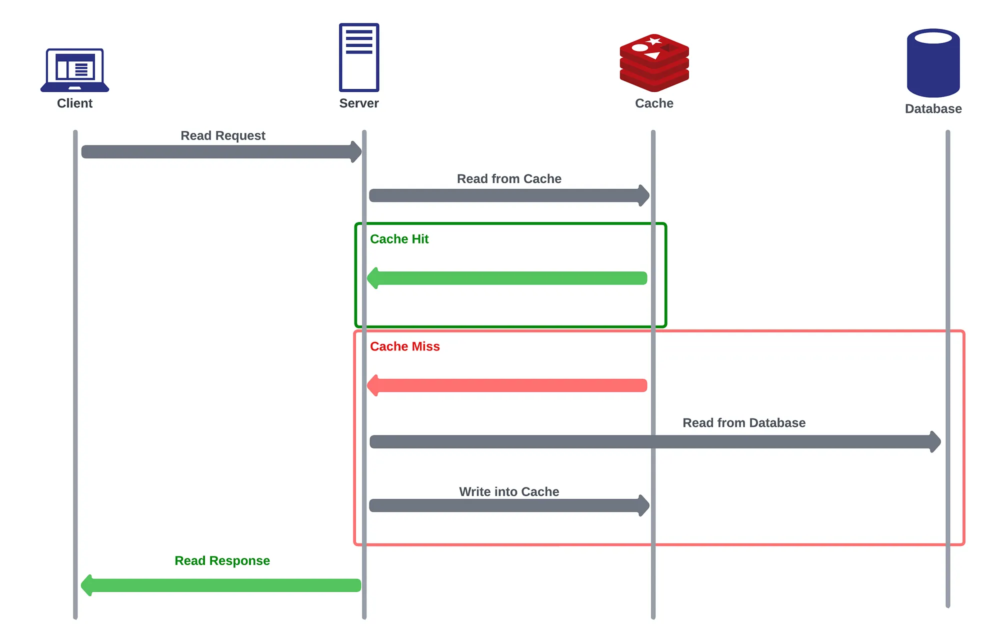
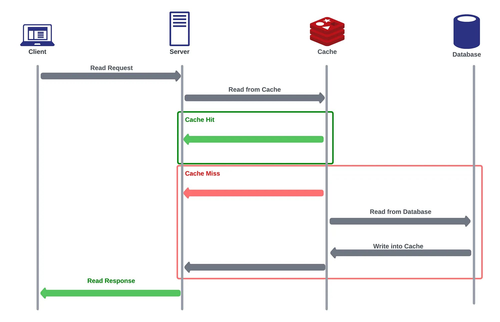
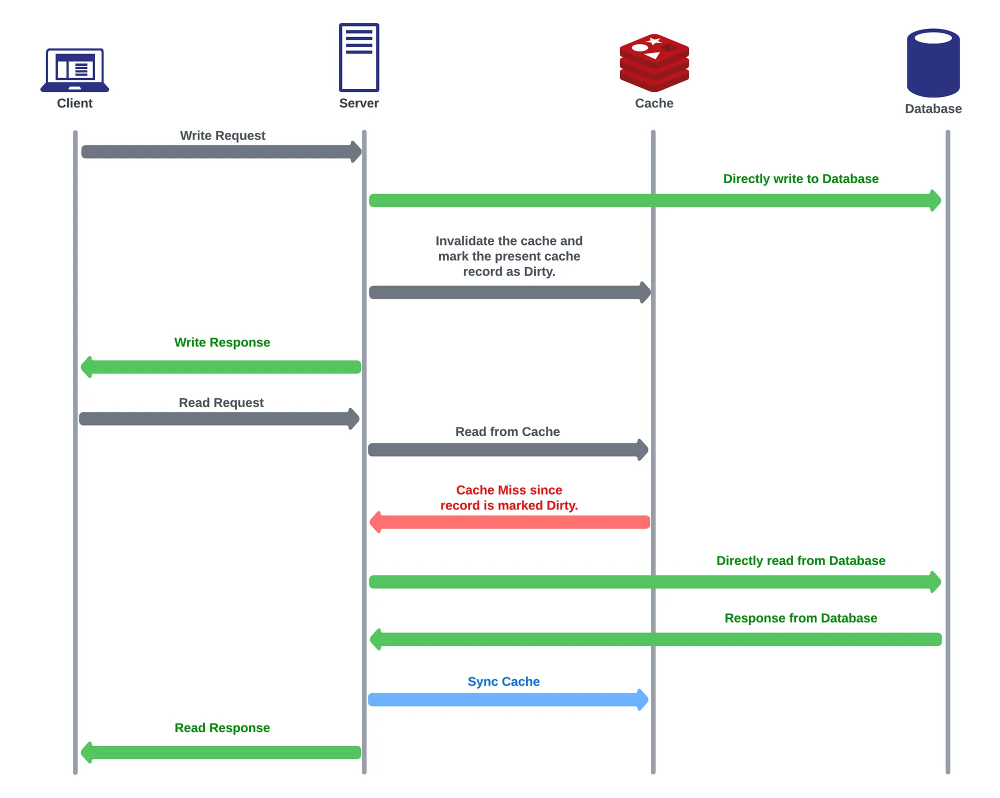
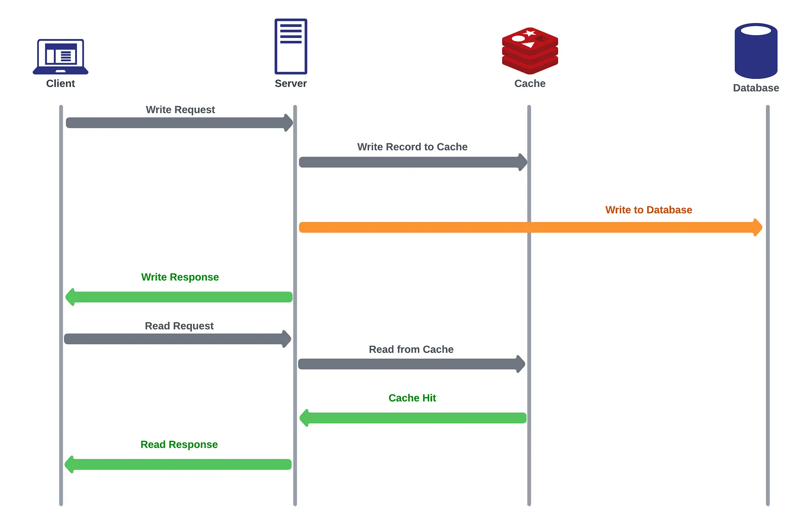
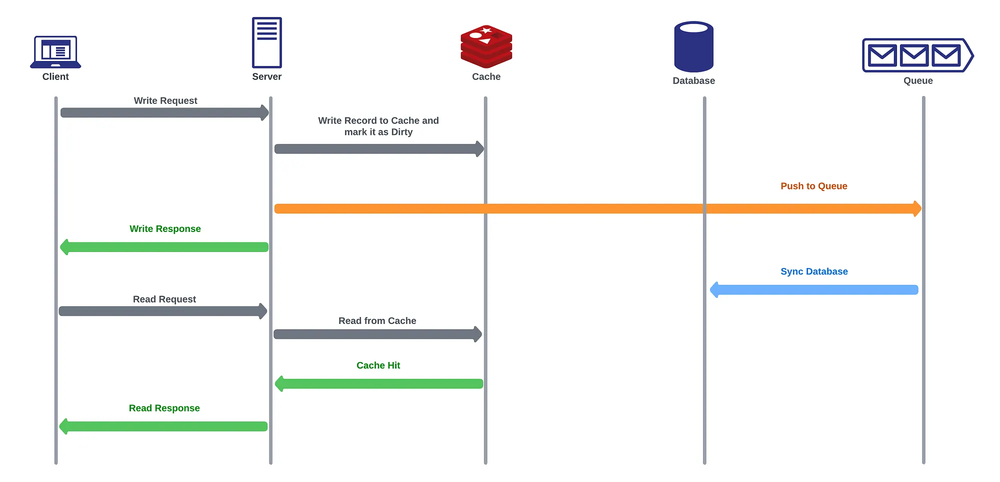

# 🧠 Caching

## ✅ What is Caching?
Caching is a technique used to store frequently accessed data in a fast-access memory (like RAM or in-memory data stores) to avoid fetching the same data repeatedly from slower sources (e.g., databases or APIs).

### ✨ Key Benefits:
- Reduces latency in responses

- Improves system performance

- Reduces load on backend systems

- Provides fault tolerance during DB or service outages

## 🧱 Caching Layers in a System
Caching can be implemented at different levels:

| Layer                 | Example / Purpose                                        |
| --------------------- | -------------------------------------------------------- |
| **Client-side**       | Browser caching, localStorage                            |
| **CDN**               | Serves static content close to the user                  |
| **Load Balancer**     | May cache responses or route efficiently                 |
| **Application Layer** | In-memory or Redis-based caching                         |
| **Database Layer**    | Query result caching (e.g., PostgreSQL cache extensions) |

## 📊 System Flow Example:
```javascript
Client → Load Balancer → App Server → Cache (e.g., Redis) → Database
```

When a request comes in, the app server first checks the cache. If the data isn't present (cache miss), it fetches it from the database and stores it in the cache for future use.

## 🌐 What is Distributed Caching?

A single-node cache has limitations:

- Scalability issues

- Single point of failure

Distributed Caching solves these by:

- Spreading cached data across multiple nodes

- Ensuring fault tolerance and horizontal scaling

- Using cache clients on app servers that communicate with cache clusters

### 🔄 How it works:
Each app server interacts with the cache cluster using consistent hashing to determine which cache node to interact with.

# 🧩 Caching Strategies

## 1. 🧠 Cache-Aside (Lazy Loading)
In this caching technique, the responsibility for managing the cache is placed on the application rather than the underlying data store or the caching layer itself.

### The Cache Aside pattern can be broken down into the following steps:

1. Read Operation:
— When the application needs to read data, it first checks the cache to see if the data is already present (cache hit).
— If the data is found in the cache, the application directly retrieves the data from the cache, avoiding the need to access the underlying data store or database. This speeds up the read operation significantly.

2. Cache Miss:
— If the data is not found in the cache (cache miss), the application proceeds to fetch the data from the underlying data store or database.
— After obtaining the data, the application then stores it in the cache, associating it with an appropriate cache key for future retrieval.

3. Cache Expiration:
— Cache-Aside caching typically involves setting an expiration time or time-to-live (TTL) for cached items. This ensures that data in the cache doesn’t become stale and that the application fetches fresh data from the data store when needed.

4. Data Return:
— The cache now returns the fetched data to the application, fulfilling the original read request.



### ✅ Advantages:
- Data Flexibility: The application has full control over what data is cached and when it should be refreshed. This flexibility allows developers to optimize caching for specific access patterns and business requirements.
- Avoidance of Cache Pollution: Since the cache is not automatically updated with every write operation to the data store, Cache-Aside reduces the risk of cache pollution with data that may not be frequently accessed.
Good for Read Heavy application

- Still works if cache is down (falls back to DB)

- Flexible: cache schema ≠ DB schema

### ❌ Disadvantages

- Cache Staleness: There might be a slight delay between the time when data is updated in the data store and the time when it is updated in the cache. This window of time can lead to stale data being served from the cache.
- First Cache Miss: For new data reads, there will always be a Cache Miss first.
- Cache Stampede: In high-traffic scenarios, when an item expires from the cache, multiple requests might simultaneously try to fetch and refresh the same data from the data store, causing a spike in traffic and potential - - - performance issues. Techniques like cache locking or refreshing can help mitigate this.

>Example Issue:
Read → cache miss → fetch A = 10 → write A = 11 to DB → cache still holds A = 10

### 🔑 Key Use

- Cache-Aside caching remains a popular and effective caching pattern, especially in scenarios where data access patterns are complex or where fine-grained control over cache behavior is required. Developers can strategically use Cache-Aside caching to optimize application performance and reduce the load on data stores

----------------------------------

## 2. 📖 Read-Through Cache
In this caching technique, when the application requests data that is not present in the cache (cache miss), the cache itself takes responsibility for fetching the data from the underlying data store or database. After retrieving the data, it stores it in the cache and then returns it to the application.

### The Read-Through Caching pattern can be broken down into the following steps:

1. Read Request:
— The application needs to read data, so it checks the cache first to see if the data is already cached.
— If the data is found in the cache (cache hit), the cache directly returns the data to the application.

2. Cache Miss:
— If the data is not found in the cache (cache miss), the cache automatically initiates a process to fetch the data from the underlying data store or database.

3. Data Retrieval:
— The cache performs a read operation on the data store to fetch the required data.

4. Cache Update:
— Once the data is retrieved, the cache stores it in its memory and associates it with an appropriate cache key for future retrieval.

5. Data Return:
— The cache now returns the fetched data to the application, fulfilling the original read request.
  


### ✅ Advantages:

- Automatic Data Loading: The cache handles data retrieval from the data store automatically, reducing the application’s burden to manage cache misses explicitly.
- Fresher Data: Since the cache fetches data from the data store on demand, the data in the cache is usually up-to-date with the latest values from the underlying data store.
- Good for Read Heavy application

### ❌ Disadvantages

- Cache Stampede: In high-traffic scenarios, when an item expires or is removed from the cache, multiple requests for the same data might simultaneously trigger cache miss and cause a spike in traffic to the data store. Techniques like cache locking can help mitigate this issue.
- Compromised Data Flexibility: The automatic fetching of data from the data store during cache miss means there is little to no flexibility in the data storage format.
- First Cache Miss: For new data reads, there will always be a Cache Miss first.
- Cache structure must mirror DB structure

### 🔑 Key Use

- Overall, Read-Through Caching is a useful caching pattern for scenarios where the application requires automatic, up-to-date data retrieval and benefits from data being readily available in the cache for subsequent read operations. By handling cache misses seamlessly, Read-Through Caching simplifies the caching process and enhances data availability and performance.


------------------------------------------------------------------
## 3. ✏️ Write Around Caching Strategy

In this caching technique, when the application performs a write operation, the data is written directly to the underlying data store or database without being immediately stored in the cache. This means that the cache is bypassed during write operations, and data is not kept in the cache until it is read again.

### The Write-Around Caching pattern can be broken down into the following steps:

1. Write Request:
— When the application needs to write data, it bypasses the cache and directly writes the data to the underlying data store or database.

2. Cache Bypass:
— Unlike other caching patterns, Write-Around Caching avoids storing the data being written into the cache.

3. Data Store Write:
— The data is immediately written to the data store, ensuring that the data is persistently stored.

4. Cache Invalidation
— The application also invalidates the previously present data in the cache marking it as dirty.
— The cache in turn checks with primary data store to keep itself in sync.




### ✅ Advantages:

- Reduced Cache Pollution: Write-Around Caching prevents infrequently accessed or large data from occupying space in the cache. This keeps the cache free for storing more frequently accessed data.
- Improved Cache Hit Rate: By reserving the cache for frequently read data, the cache hit rate can be improved, resulting in faster read operations.
- Used for heavy read operation
- resolve inconsistency between DB and cache


### ❌ Disadvantages

- Slower Read Operations: Data that is written around the cache is not available in the cache for subsequent read operations. Therefore, read operations for the recently written data might be slower since they need to fetch the data directly from the data store.
- Stale Data: Since the data is not initially stored in the cache, read operations may retrieve stale data if the data has been updated in the data store but not yet fetched into the cache.
- Limited Performance Boost: Write-Around Caching does not provide immediate performance benefits for write operations, as it does not leverage the cache for writes. If read performance is critical, other caching patterns like Write-Through or Write-Back might be more suitable.
- For New data read there will be always cache miss
- if Db is down write request will fails

### 🔑 Key Use

Write-Around Caching is a suitable choice when the cache capacity is limited, and it is essential to prioritize frequently accessed data in the cache. By selectively caching data based on access patterns, Write-Around Caching helps maintain a high cache hit rate for more relevant data while preserving cache space for optimal read performance.

## 4. ✍️ Write-Through Cache

In this caching technique, when the application performs a write operation, the data is written both to the cache and the underlying data store or database simultaneously. This ensures that the data remains consistent between the cache and the data store at all times.

### The Write-Through Caching pattern can be broken down into the following steps:

1. Write Request:
— When the application needs to write data, it first updates the data in the cache.

2. Data Store Write:
— After updating the cache, the data is immediately written to the underlying data store or database.

3. Write Acknowledgment:
— The write operation is not considered complete until both the cache and the data store have acknowledged the successful write.



### ✅ Advantages:

- Data Consistency: Since data is written to both the cache and the data store simultaneously, the cache and the data store always contain consistent data.
- Reliability: Write-Through Caching ensures that all data modifications are immediately and durably stored in the data store, reducing the risk of data loss in the event of system failures.
- Reduced Risk of Stale Data: Since data is always written to the data store, read operations for recently written data will retrieve the latest version from the cache or the data store.

### ❌ Disadvantages

- Write Latency: Writing data to both the cache and the data store in every write operation can introduce additional latency compared to other caching patterns like Write-Around or Write-Back.
- Lower Write Performance: The need to wait for acknowledgment from both the cache and the data store before considering the write operation complete might affect write performance.
- Cache Pollution: Frequent writes can potentially fill up the cache with data that is not frequently accessed, reducing the overall cache hit rate for more relevant data.

### 🔑 Key Use

Write-Through Caching is a suitable choice when data consistency and durability are critical, such as in financial systems or databases. By ensuring that data is always consistent between the cache and the data store, Write-Through Caching provides a robust and reliable caching mechanism for systems that require strict data integrity.


## 5. 📨 Write-Back (Write-Behind) Cache

In this caching technique, when the application performs a write operation, the data is first written to the cache but not immediately to the underlying data store or database. Instead, the cache marks the data as “dirty” or “modified” to indicate that it has been modified in the cache but not yet written to the data store.

### The Write-Back Caching pattern can be broken down into the following steps:

1. Write Request:
— When the application needs to write data, it first updates the data in the cache.

2. Cache Update:
— After updating the cache, the data is marked as “dirty” or “modified” to indicate that it has been changed in the cache.

3. Data Store Update (Deferred):
— Unlike other caching patterns like Write-Through, the data is not immediately written to the underlying data store and is pushed to some deferred tool like a Queue.

4. Write Acknowledgment:
— The write operation is considered complete once the data is updated in the cache. The cache handles the deferred write to the data store later, during a more suitable time.



### ✅ Advantages:

- Good for write heave operations
- Reduced Data Store Writes: Since data is not immediately written to the data store for every write operation, Write-Back Caching reduces the number of write operations, which can significantly improve write performance.
- Lower Write Latency: Writing data to the cache is faster than writing to the data store, so write operations complete faster, improving overall system responsiveness.
- Optimized Write Operations: By batching multiple updates and writing them to the data store in one go, Write-Back Caching optimizes the data store writes, reducing the overhead associated with frequent small writes.

### ❌ Disadvantages

- Data Integrity Risk: In the event of a system failure or crash, the “dirty” data in the cache that has not yet been written to the data store might be lost, potentially leading to data inconsistency between the cache and the data store.
- Cache Eviction Complexity: Managing “dirty” data in the cache requires careful consideration of cache eviction policies to ensure important data is not evicted before being written back to the data store.
- Higher Cache Complexity: Write-Back Caching introduces additional complexity in cache management due to the need to track modified data and ensure its eventual write-back to the data store.

### Cache miss  process
- When a read request occurs before the “dirty” data is written back to the data store, the cache handles the read request as usual. It first checks if the requested data is present in its memory (cache hit). If the data is found in the cache, it is directly returned to the application, and the read operation is completed.

- However, if the requested data is not present in the cache (cache miss), the cache needs to fetch the data from the data store. This is where the “dirty” data comes into play:

1. Cache Miss — Dirty Data:
   - If the read request encounters a cache miss (i.e., the data is not in the cache), and there is “dirty” data in the cache (data that has been modified but not yet written back to the data store), the cache has two options:

- Read-Modify-Write: One option is to perform a read-modify-write operation. The cache first fetches the requested data from the data store, provides it to the application, and then updates the cache with the newly fetched data. If there is any “dirty” data for the same cache key, it will be replaced with the fresh data from the data store. This way, the cache becomes consistent with the data store again.

- Wait for Write Back: Another option is to wait for the “dirty” data to be written back to the data store before fulfilling the read request. In this case, the cache temporarily stalls the read operation until the write-back process is complete, ensuring that the read operation retrieves the latest data from the data store.

2. Cache Miss — No Dirty Data:
    - If the read request encounters a cache miss, and there is no “dirty” data for the requested cache key, the cache proceeds to fetch the data from the data store as usual and provides it to the application.

### 🔑 Key Use

Write-Back Caching is commonly used in scenarios where write performance is critical and the risk of data loss due to system failures can be mitigated using techniques like backup power or battery-backed caches. By deferring data store writes and optimizing write operations, Write-Back Caching improves overall system performance and responsiveness for write-heavy workloads.


## 🔁 Summary Table
| Strategy      | Read Speed | Write Speed | Consistency | Use Case                   |
| ------------- | ---------- | ----------- | ----------- | -------------------------- |
| Cache-Aside   | High       | Medium      | Medium      | General purpose, reads     |
| Read-Through  | High       | N/A         | Medium      | Decoupled read logic       |
| Write-Around  | High       | High        | Low         | Write-light, read-heavy    |
| Write-Through | Medium     | Medium      | High        | Consistent writes needed   |
| Write-Back    | High       | Very High   | Eventual    | Write-heavy, tolerant apps |
