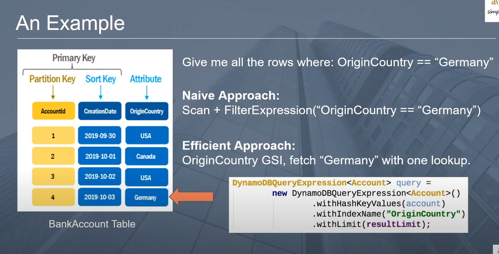

# AWS DynamoDB schema design

- Every table have required the primary key
- primary key can be only partition key or combination of the partition and sort key
- Based on the partition key dynamodb created no of partitions to store the data so for example partiton key is obj.id  then for each id it create seperate partition internally that's why dynamodb is **More efficient** compared to others

- If you provide the sort key then dynamo will store the data in partiton based on partition key and it will  be in sorted order as per the sort key

**Note: if partition key can be duplicate values then you must have to provide sort, without sort key the partition key will be unique so based on your requirement you have to select it**

- if sort key is present then combination of the partition and sort key will formed primary key and it must be **unique globally**

## When to use what key

- Are you always want quick lookup and that will be unique globally:- **use only partition key**
- if key is non-unique and you want to query based on other field:- **use partition + sort Key**

## Global Secondary Index(GSI)

### Why we need it?

- for example we want to fetch data based on the attribute as OriginCountry then it is impossible to fetch data because it is not a partition or sort key then GSi comes into the picture
- We can do with Scan but it is not efficient approach to do it because it scan all the documents
- using GSI we are creation index and using that we can fetch the data more quickly
- 